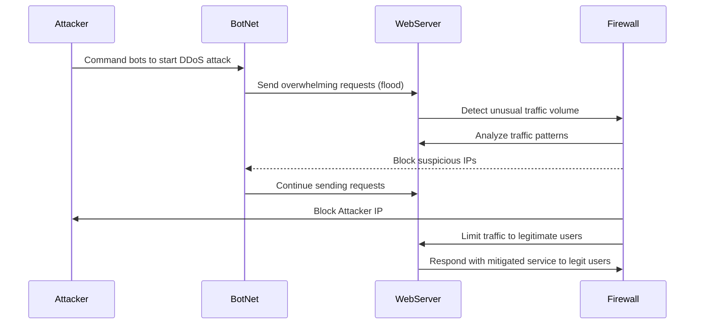

<!--

Sequence Steps:

1) Attacker Commands the BotNet: The attacker starts the DDoS attack by telling a group of hacked computers (called a BotNet) to flood the web server with tons of requests.
2) BotNet Sends Flood of Requests to WebServer: The botnet, which could be made up of hundreds or even thousands of hacked devices, starts sending a huge amount of requests to the web server. This overloads the server, making it impossible for real users to access it.
3) WebServer Detects Unusual Traffic Volume: The web server notices a sudden spike in traffic. It realizes something’s off and sends this information to the firewall so it can check out what the situation is.
4) Firewall Analyzes Traffic Patterns: The firewall looks at all the incoming traffic, trying to spot patterns like repeated requests from the same IP addresses, or other not normal things that might indicate a DDoS attack. This is where the defense begins.
5) Firewall Blocks Suspicious IPs from BotNet: After checking the traffic, the firewall starts blocking the IP addresses that are sending fake requests. This lightens the load on the web server by stopping more bad requests from the bots.
6) BotNet Continues Sending Requests: Even though the firewall is blocking some of the bots, the botnet keeps trying to send requests. There are so many bots that some requests still get through, but the firewall is trying its best to keep it under control.
7) Firewall Blocks Attacker’s IP: The firewall also blocks the attacker’s own IP address, cutting off any direct access they have to the web server.
8) Firewall Limits Traffic to Legitimate Users: The firewall takes extra steps like slowing down or filtering traffic.
9) WebServer Responds to Legitimate Users: Now that the firewall is handling the attack, the web server can focus on helping real users. It manages the amount of requests it responds to, so that the attack doesn’t totally shut it down.

These are the participants:
- Attacker: The person who starts the attack.
- BotNet: This is the group of hacked computers that send the flood of traffic
- WebServer: The target of the attack
- Firewall: The main defense. It watches the traffic, blocks bad IP addresses and makes sure that real users can use the server.

-->