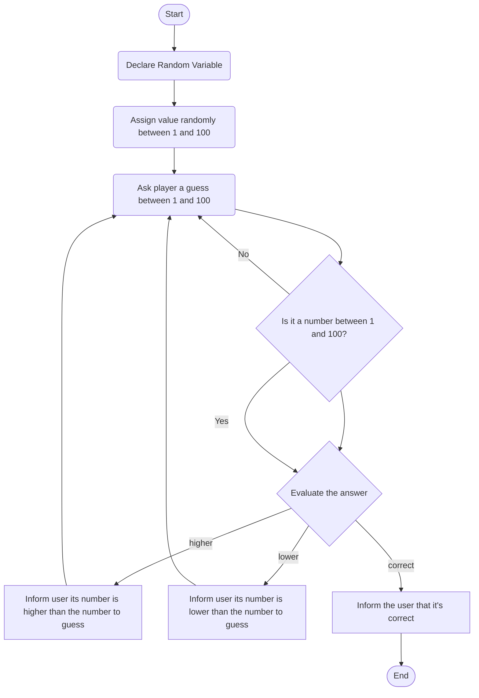

```mermaid
flowchart TD


 Start([Start]) --> A(Declare Random Variable) --> B(Assign value randomly between 1 and 100) --> C(Ask player a guess between 1 and 100) --> Validation{Is it a number between 1 and 100?} --> Evaluation{Evaluate the answer}  

Validation --> |Yes| Evaluation
Validation --> |No| C

Evaluation --> |higher| E[Inform user its number is higher than the number to guess]
Evaluation --> |lower| F[Inform user its number is lower than the number to guess]
Evaluation --> |correct| G[Inform the user that it's correct]

G --> End([End])


E --> C
F --> C


```