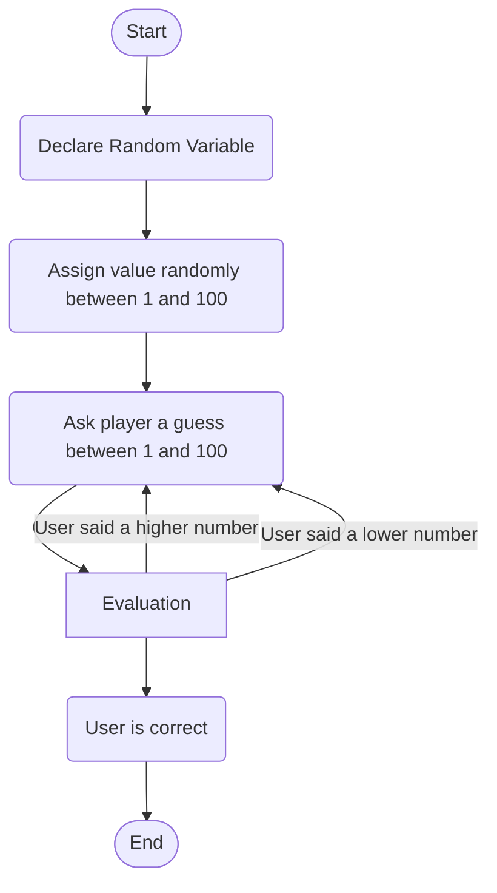

```mermaid
flowchart TD


 Start([Start]) --> A(Declare Random Variable) --> B(Assign value randomly between 1 and 100) --> C(Ask player a guess between 1 and 100) --> Evaluation --> D(User is correct) --> End([End])

Evaluation --> |User said a higher number| C
Evaluation --> |User said a lower number| C

```