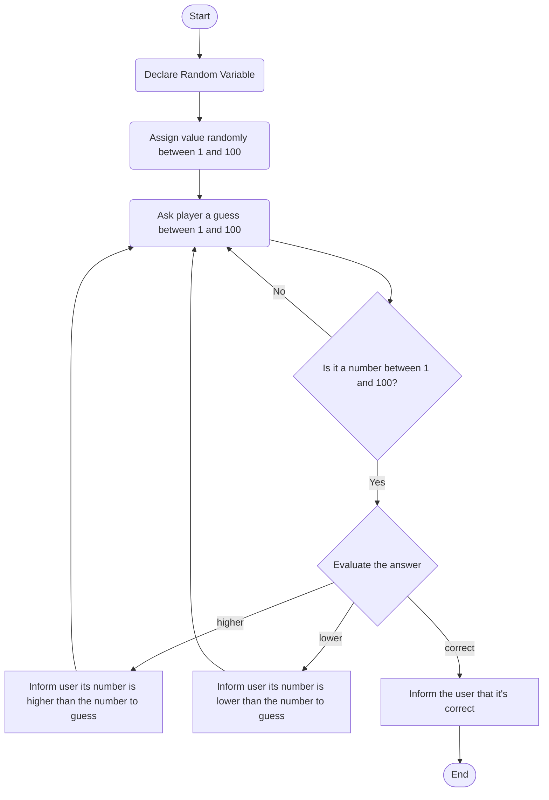

<!--

The process follows a flow from START to END with two moments when the answer of the user is evaluated.
In the first one, validation, the system evaluate if the answer is a number between 1 and 100. If so, it continues. If not, it ask the user a number again
In the second one, evaluation, the system evaluate if the answer is correct. If so, it goes to END. If not, it informs the user iif its guess is lower or higher than the number to guess and ask the user a number again

-->