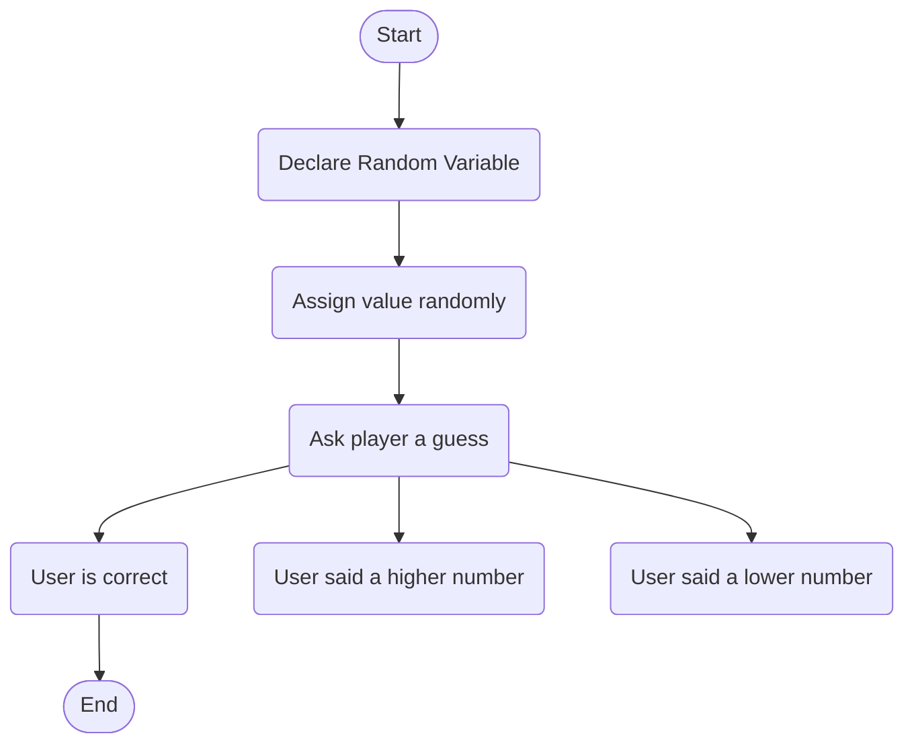

```mermaid
flowchart TD


 Start([Start]) --> A(Declare Random Variable) --> B(Assign value randomly) --> C(Ask player a guess) --> D(User is correct) --> End([End])

C --> E(User said a higher number)
C --> F(User said a lower number)

```