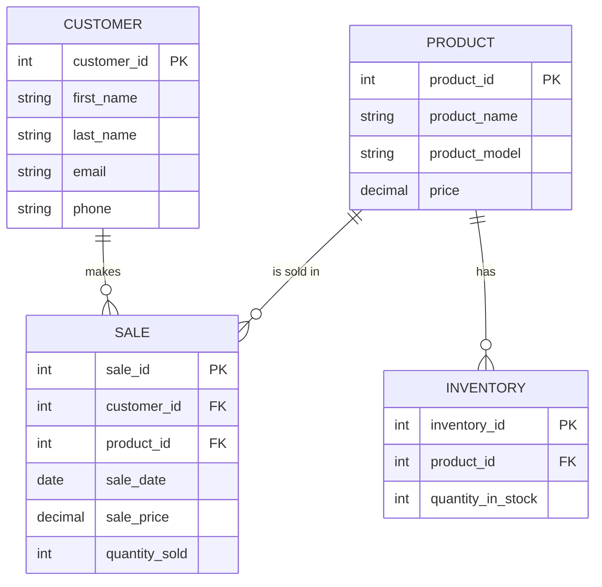

<!--

Entities:
Customer:

Stores details about the customers who purchase shoes from the store.
Attributes include:
customer_id: Primary Key, uniquely identifies each customer.
first_name, last_name, email, phone: Personal information of the customer.
Product:

Represents different models of Nike shoes available for sale.
Attributes include:
product_id: Primary Key, uniquely identifies each product.
product_name, product_model, price: Details about the shoe models and their prices.
Inventory:

Tracks the stock levels for each product in the store.
Attributes include:
inventory_id: Primary Key, uniquely identifies each inventory record.
product_id: Foreign Key referencing Product, indicating which product the inventory record refers to.
quantity_in_stock: The number of units available for the product.
Sale:

Records individual transactions when customers purchase products.
Attributes include:
sale_id: Primary Key, uniquely identifies each sale.
customer_id: Foreign Key referencing Customer, indicating the customer who made the purchase.
product_id: Foreign Key referencing Product, indicating the product sold.
sale_date, sale_price, quantity_sold: Details about the transaction such as date, price, and quantity.
Relationships:
Customer makes Sales:

A customer can make many purchases over time, and each sale is linked back to a specific customer (one-to-many relationship).
Product is Sold in Sales:

A product can appear in many sales records. Each sale is linked to the specific product sold (one-to-many relationship).
Product has Inventory:

Each product has an associated inventory record that tracks the quantity of that product in stock (one-to-one relationship).
Business Significance:
Customer to Sales: This relationship helps track which customers are purchasing products, allowing the business to analyze customer behavior and sales trends.
Product to Sales: By linking products to sales, the business can monitor which shoe models are popular and adjust inventory or promotions accordingly.
Product to Inventory: Maintaining an accurate relationship between products and inventory is crucial for effective stock management, ensuring that popular shoes are always available while avoiding overstock.

-->